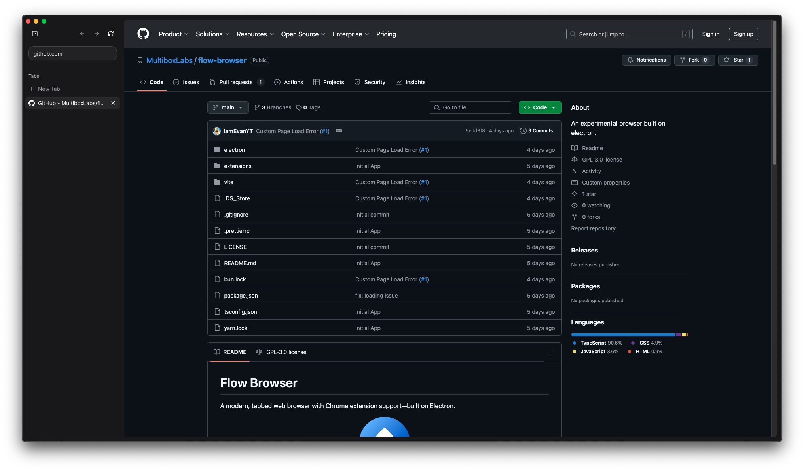
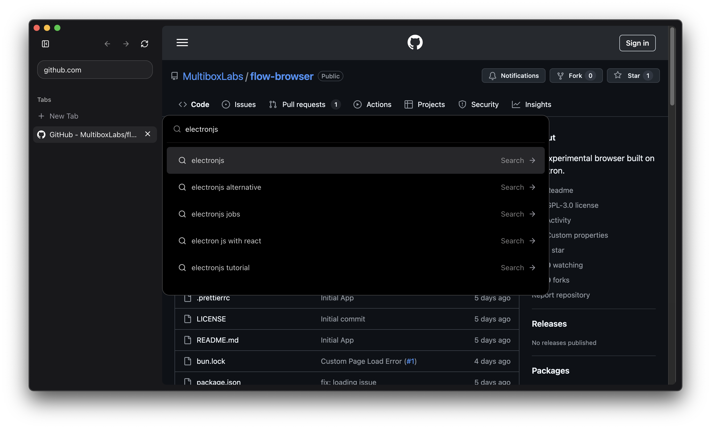
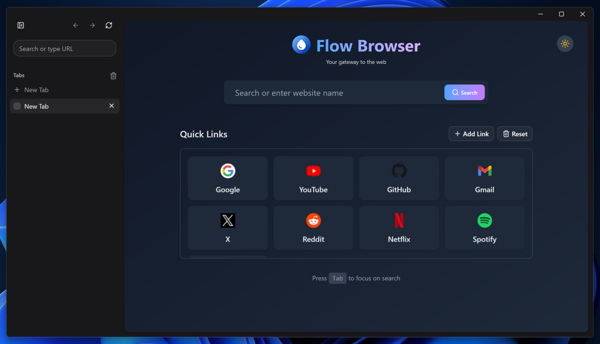
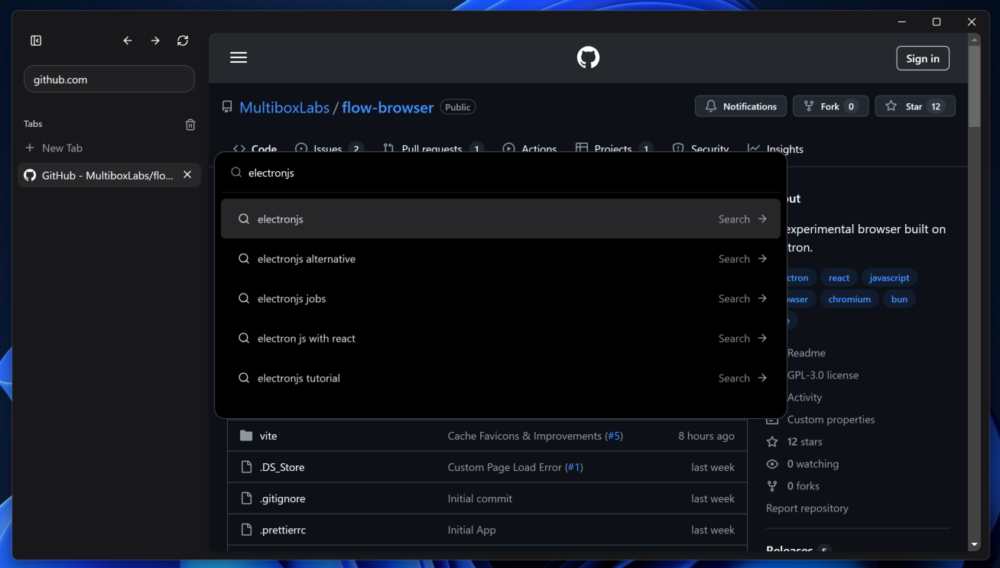

# Flow Browser

A modern, tabbed web browser with Chrome extension support—built on Electron.

<p align="center">
  
</p>

[](https://opensource.org/licenses/)


## Overview

Flow Browser is a lightweight, feature-rich web browser that combines the power of Chromium with a clean, modern interface. Built on Electron, it offers full support for Chrome extensions, making it a versatile alternative to mainstream browsers.

## Install (v0.3.2)

> [!WARNING]
>
> macOS's version is not currently code-signed!
>
> If you just download it from your browser, it will be blocked by [Gatekeeper](https://disable-gatekeeper.github.io/), which says 'This application is damaged' and will not let you open it.

### macOS:

```bash
# Run this command in your terminal
curl -LO https://github.com/MultiboxLabs/flow-browser/releases/download/v0.3.2/FlowInstaller.dmg && open .
```

### Windows:

Download [FlowSetup.exe](https://github.com/MultiboxLabs/flow-browser/releases/download/v0.3.2/FlowSetup.exe)

### Linux:

Choose the file you need and [download from GitHub Releases](https://github.com/MultiboxLabs/flow-browser/releases).

## Screenshots






## Features

- **Modern UI**: Clean, intuitive interface built with React 19 and Tailwind CSS
- **Extension Support**: Compatible with most Chrome extensions from the Chrome Web Store
- **Better New Tab**: Shows a popup omnibox which lets you search the web or quickly open a new tab, bookmark, or history.
- **Wide Customization**: Custom icons, new page mode, and more.

## Contributing

See [CONTRIBUTING.md](./CONTRIBUTING.md) for more information.

## License

This project is licensed under the GNU General Public License v3.0 (GPL-3.0) - see the [LICENSE](./LICENSE) file for details.

## Acknowledgements

Some parts of Flow Browser are based on [electron-browser-shell](https://github.com/samuelmaddock/electron-browser-shell) by [Sam Maddock](https://github.com/samuelmaddock), with enhancements and modifications.

Design inspired by [Arc Browser](https://arc.net) and [Zen Browser](https://zen-browser.app/), which has a minimalistic design that is clean and simple.
