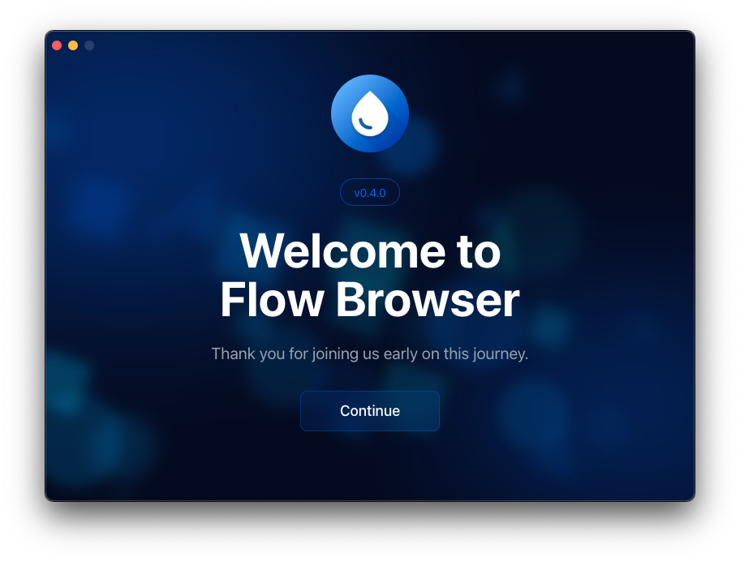
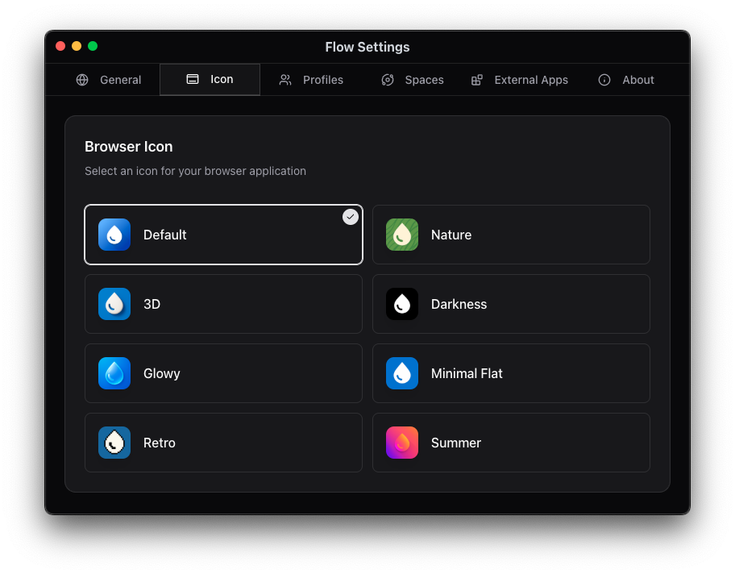

# Flow Browser

A modern, tabbed web browser with Chrome extension support—built on Electron.

<p align="center">
  
</p>

[](https://opensource.org/licenses/)


## Overview

Flow Browser is a lightweight, feature-rich web browser that combines the power of Chromium with a clean, modern interface. Built on Electron, it offers full support for Chrome extensions, making it a versatile alternative to mainstream browsers.

## Install (v0.4.0)

> [!WARNING]
>
> macOS's version is not currently code-signed!
>
> If you just download it from your browser, it will be blocked by [Gatekeeper](https://disable-gatekeeper.github.io/), which says 'This application is damaged' and will not let you open it.

### macOS:

```bash
# Run this command in your terminal
curl -LO https://github.com/MultiboxLabs/flow-browser/releases/download/v0.4.0/FlowInstaller.dmg && open .
```

### Windows:

Download [FlowSetup.exe](https://github.com/MultiboxLabs/flow-browser/releases/download/v0.4.0/FlowSetup.exe)

### Linux:

Choose the file you need and [download from GitHub Releases](https://github.com/MultiboxLabs/flow-browser/releases).

## Screenshots






## Features

- **Profiles**: Multiple profiles support, allowing you to use different settings and extensions for each profile.
- **Spaces**: Multiple spaces support, allowing you to organize your tabs into different spaces.
- **Sidebar**: A sidebar that allows you to quickly access your bookmarks, history, and settings.
- **Command Palette**: A command palette that allows you to search the web or quickly open a new tab, bookmark, or history.
- **Good Security**: Asks before opening external applications.
- **Simple Onboarding**: A simple onboarding process that allows you to quickly get started.
- **Wide Customization**: Custom icons, new page mode, and more.
- **Offline Games**: A collection of offline games to play when you have nothing to do. (flow://games)

## Upcoming Features

- **Reorder Tabs**: Allow you to reorder tabs.
- **Native Adblocker**: A native adblocker that blocks ads and trackers.
- **Topbar**: Allow you to customise between a topbar or sidebar.
- **Downloads**: Allow you to download files from the web.
- **Extensions**: Allow you to install chrome extensions from the Chrome Web Store.
- **Favourites**: Allow you to add websites to your favourites.
- **Pinned Tabs**: Allow you to pin tabs in spaces.
- **Persist Tabs**: Allow you to persist tabs between restarts.
- **Sleep Tabs**: Allow you to put tabs to sleep to save resources.
- **Custom Search Engines**: Allow you to add custom search engines.
- **Preview Tabs**: Allow you to preview tabs before switching to them.
- **Widewine Support**: Allow you to watch DRM protected content.

## Feedback / Feature Requests / Bugs

https://flowbrowser.userjot.com/

## Contributing

See [CONTRIBUTING.md](./CONTRIBUTING.md) for more information.

## License

This project is licensed under the GNU General Public License v3.0 (GPL-3.0) - see the [LICENSE](./LICENSE) file for details.

## Acknowledgements

Some parts of Flow Browser are based on [electron-browser-shell](https://github.com/samuelmaddock/electron-browser-shell) by [Sam Maddock](https://github.com/samuelmaddock), with enhancements and modifications.

Design inspired by [Arc Browser](https://arc.net) and [Zen Browser](https://zen-browser.app/), which has a minimalistic design that is clean and simple.
